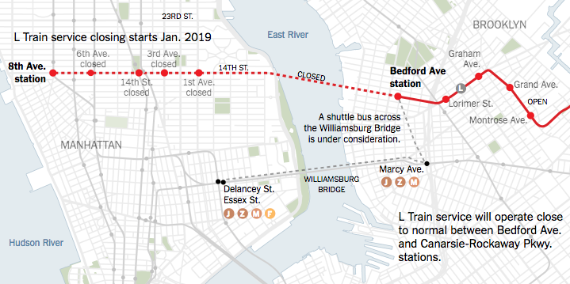

## L Train User Destinations Based on Twitter Data
Start Date: Feb, 2017 

## Member

Dongjie Fan, Felipe Diego Gonzalez, Lani Mcleod, Ekaterina Levitskaya

## Description

The research question for the project is defined as the following: **Can Twitter data provide current information on L train user destinations?**

**L train** reconstruction plans project a potential [shutdown](https://www.nytimes.com/2016/07/26/nyregion/l-train-will-shut-down-between-manhattan-and-brooklyn-in-2019-for-18-months.html?_r=0) for a long time. For planning purposes it is important to identify the impact of the shutdown for different users and their destinations. This project attempts to identify destinations of L train users based on geo-tagged Twitter data. In this project we propose to use **geo-tagged Twitter data** as proxy of L train user destinations. We devise a methodology for finding L train users' origin-destination matrix of Brooklyn to Manhattan based on Twitter data. Then validated the data against **Longitudinal Employer-Household Dynamics (LEHD)** census data.

This analysis could be especially useful for such city agencies as the *Metropolitan Transportation Authority (**MTA**)*, *Department of Transportation (**DOT**)* and *Department of City Planning (**DCP**)*

## Methodology

The methodology for this project consisted of first creating a matrix of **“home”** and **“work”** locations of L train users using **2014 Longitudinal Employer-Household Dynamics (LEHD)** data. Second, using informed assumptions and clustering methods like **Gaussian Mixture** to identify “home” and “work” locations of L train users using **2014 Twitter data**. We grouped these observations by **NYC community districts boundaries** in order verify their similarity using a **chi-squared test** for similarity across the two distributions.

## Data

* **LEHD Origin-Destination Employment Statistics (LODES) from United States Census Bureau - for New York City, 2014. **
  * Data files are state-based and organized into three types: Origin-Destination (OD), Residence Area Characteristics (RAC), and Workplace Area Characteristics (WAC), all at census block geographic detail.
* **Geo-coded Twitter data from CUSP Data Facility - for New York City, November 2014 - February 2015.**
  * The Twitter data was not continuous and limited to geo-tagged tweets.
* **New York City Community Districts Boundaries** 
  * from NYC Open Data at https://opendata.cityofnewyork.us/

## References

1. Kurkcu, A., Ozbay K., Morgul E. (2015). Evaluating the Usability of Geo-Located Twitter as a Tool for Human Activity and Mobility Patterns: a Case Study for NYC.
2. Yin J., Gao Y., Du Z., Wang S. (2016). Exploring Multi-Scale Spatiotemporal Twitter
   User Mobility Patterns with a Visual-Analytics Approach

photos by [*media.nbcnewyork.com*](http://media.nbcnewyork.com/images/620*349/WNBC_000000011416379_1200x675_680457283902.jpg), [*notey.com*](https://4d0850cecf2c5ce919d5-17b283ac00835b5ced4db83c898330a1.ssl.cf1.rackcdn.com/11491463_l-train-shutdown-study-calls-for-subsidized_td75b3ed1.jpg) and [*The New York Times*](https://www.nytimes.com/2016/07/26/nyregion/l-train-will-shut-down-between-manhattan-and-brooklyn-in-2019-for-18-months.html?_r=0)

